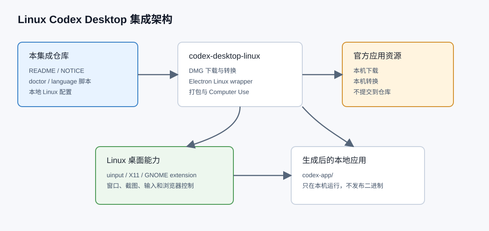
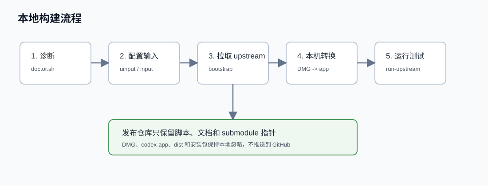

# Linux Codex Desktop 集成工作区

> 非官方 Linux Codex Desktop 集成项目。目标是在 Linux 桌面上尽量接近官方 Windows/macOS Codex Desktop 的使用体验。



## 项目定位

这个仓库不是 OpenAI 官方项目，也不分发 OpenAI Codex Desktop 的二进制文件。它是一个 Linux 本地集成工作区，主要做三件事：

- 复用公开 upstream 项目，把官方桌面应用在本机转换成可运行的 Linux Electron 应用。
- 配置 Linux Computer Use、桌面控制、浏览器控制等 Linux 侧能力。
- 沉淀后续扩展层，比如项目记忆、MCP 配置、会话摘要和 Linux 专用诊断工具。

当前第一阶段使用 [`ilysenko/codex-desktop-linux`](https://github.com/ilysenko/codex-desktop-linux) 作为基础 upstream。该项目已经实现了从官方 macOS `Codex.dmg` 转换为 Linux Electron app 的主要流程，并提供 Linux 打包、启动脚本和 Computer Use 后端。

## 重要声明

本仓库只发布集成脚本、说明文档和本地配置工具，不发布以下内容：

- `Codex.dmg`
- 解包/生成后的 `codex-app/`
- `.deb`、`.rpm`、`.pkg.tar.zst`、`.AppImage` 等安装包
- 任何 OpenAI 官方应用二进制、图标资源或受限资产

如果你 clone 本仓库，需要在自己的机器上运行构建脚本，由 upstream wrapper 在本地下载并转换所需资源。

## 已实现能力

- Linux 桌面应用启动，而不是只使用终端 CLI。
- 复用官方 Codex Desktop 的主体验。
- 支持通过本地配置启用 Linux Computer Use UI。
- 支持中文/英文/自动检测语言切换。
- 提供 `doctor` 诊断脚本，检查系统环境、依赖、Computer Use、语言设置和发布安全边界。
- 通过 submodule/checkout 方式复用 `codex-desktop-linux` upstream。
- 避免把官方 DMG、生成应用和安装包提交到 GitHub。

## 当前测试环境

本项目目前在以下环境做过本地测试：

- Ubuntu 24.04
- GNOME / X11
- Rust stable
- Electron 生成应用
- `/dev/uinput` 已配置为 `root:input 0660`
- GNOME 窗口定位扩展已安装
- 中文界面通过 `localeOverride: "zh-CN"` 验证可用

不同发行版、Wayland、KDE、原子桌面和其他窗口管理器可能需要额外验证。

## 快速开始

克隆仓库后，先检查本机状态：

```bash
./scripts/doctor.sh
```

准备 Linux 输入权限：

```bash
./scripts/configure-linux-input.sh
```

> 执行后建议注销并重新登录，让桌面应用继承新的 `input` 组权限。

拉取/准备 upstream：

```bash
./scripts/bootstrap-upstream.sh
```

构建生成 Linux Electron app：

```bash
./scripts/build-upstream-app.sh
```

运行应用：

```bash
./scripts/run-upstream-app.sh
```

安装成真正的桌面应用：

```bash
./scripts/install-desktop-app.sh
```

安装后会写入：

```text
~/.local/share/applications/codex-desktop.desktop
~/.local/share/icons/hicolor/256x256/apps/codex-desktop.png
~/.local/bin/codex-desktop
~/.config/systemd/user/codex-desktop-workspace-restore.service
~/.config/systemd/user/codex-desktop-workspace-restore.path
```

之后可以从系统应用菜单搜索 `Codex Desktop` / `Codex 桌面版` 启动，也可以运行：

```bash
gtk-launch codex-desktop
```

如果图标没有马上刷新，关掉当前 Codex 窗口后从应用菜单重新打开。安装脚本使用图标绝对路径，避免 GNOME 图标主题缓存继续显示 fallback 齿轮图标。

卸载用户级桌面入口：

```bash
./scripts/uninstall-desktop-app.sh
```

卸载脚本只删除用户级桌面入口、图标、命令和 workspace restore systemd 单元，不会删除生成后的 `codex-app/`。

## 中文和语言切换

本项目提供一个小脚本修改本地 Codex Desktop 设置文件：

```bash
./scripts/set-language.sh zh-CN
```

切回英文：

```bash
./scripts/set-language.sh en
```

恢复自动检测：

```bash
./scripts/set-language.sh auto
```

配置文件位置：

```text
~/.config/codex-desktop/settings.json
```

设置项示例：

```json
{
  "codex-linux-computer-use-ui-enabled": true,
  "localeOverride": "zh-CN"
}
```

修改语言后需要重启应用。

## Computer Use UI

启用 Linux Computer Use UI：

```bash
./scripts/enable-computer-use-ui.sh
```

该脚本会保留已有配置，只补充：

```json
{
  "codex-linux-computer-use-ui-enabled": true
}
```

如果需要检查状态：

```bash
./scripts/doctor.sh
```

## 项目记忆和会话索引

本项目提供一个本地项目记忆脚本，用来识别项目技术栈、包管理器、常用命令，并把结果持久化到本机 SQLite 数据库：

```bash
./scripts/project-memory.js scan /path/to/project
```

默认数据库位置：

```text
~/.local/state/linux-codex-desktop/project-memory.sqlite
```

常用命令：

```bash
./scripts/project-memory.js scan /home/hyk/linux-codex-desktop
./scripts/project-memory.js refresh /home/hyk/linux-codex-desktop
./scripts/project-memory.js refresh --all
./scripts/project-memory.js show /home/hyk/linux-codex-desktop
./scripts/project-memory.js threads /home/hyk/linux-codex-desktop
./scripts/project-memory.js summaries /home/hyk/linux-codex-desktop
./scripts/project-memory.js snapshot /home/hyk/linux-codex-desktop
./scripts/project-memory.js workspace status /home/hyk/linux-codex-desktop
./scripts/project-memory.js workspace register /home/hyk/linux-codex-desktop
./scripts/project-memory.js backup
./scripts/project-memory.js backup --keep 20
./scripts/project-memory.js backup list
./scripts/project-memory.js backup verify
./scripts/project-memory.js list
./scripts/project-memory.js pref init /home/hyk/linux-codex-desktop
./scripts/project-memory.js persistence mark /home/hyk/linux-codex-desktop
./scripts/project-memory.js persistence check /home/hyk/linux-codex-desktop
./scripts/project-memory.js export-context /home/hyk/linux-codex-desktop
./scripts/test-restart-persistence.sh mark /home/hyk/linux-codex-desktop
./scripts/test-restart-persistence.sh check /home/hyk/linux-codex-desktop
```

运行完整持久化自检：

```bash
./scripts/verify-project-memory.sh /home/hyk/linux-codex-desktop
```

该脚本会扫描项目、验证项目记忆库、导出会话快照，并模拟 `~/.codex/.codex-global-state.json` 被覆盖回 `/home/hyk` 后能否由 systemd watcher 自动恢复项目工作区。

按项目保存本地偏好：

```bash
./scripts/project-memory.js pref init /home/hyk/linux-codex-desktop
./scripts/project-memory.js pref set /home/hyk/linux-codex-desktop language zh-CN
./scripts/project-memory.js pref get /home/hyk/linux-codex-desktop language
./scripts/project-memory.js pref list /home/hyk/linux-codex-desktop
```

`scan` 会自动初始化默认偏好；`pref init` 可以手动补齐缺失的默认项，但不会覆盖你已经改过的值。当前默认会记录语言、桌面控制后端、workspace restore/watch 开关，以及识别到的常用项目命令。

当前支持识别：

- Node / JavaScript / TypeScript：`package.json`、`pnpm-lock.yaml`、`yarn.lock`、`package-lock.json`、`bun.lock`
- Python：`pyproject.toml`、`requirements.txt`、`uv.lock`、`poetry.lock`
- Rust：`Cargo.toml`
- Go：`go.mod`
- Makefile：`Makefile` / `makefile` / `GNUmakefile` 中的 `dev`、`test`、`build`、`lint` 等目标
- 通用 Linux 桌面集成仓库：`scripts/`、`README.md`、`LICENSE`、`NOTICE`、`docs/`

`export-context` 会输出项目根目录、Git 状态、识别到的技术栈和命令、本地偏好、Codex workspace 持久化状态，以及已有的项目会话和摘要索引，方便后续首次启动向导或恢复界面直接复用。

`scan` 会自动把项目根目录注册进 Codex Desktop 的工作区状态：

```text
~/.codex/.codex-global-state.json
```

写入前会自动生成一份 `.bak-时间戳` 备份。它只会把项目路径追加到 `electron-saved-workspace-roots` 和 `active-workspace-roots`，不会删除原有工作区。注册后建议重启 Codex Desktop，让左侧会话列表按新的工作区状态刷新。

本仓库的启动脚本会在打开 Codex Desktop 前自动执行：

```bash
./scripts/project-memory.js refresh --all
```

这会重扫已记住项目、同步 Codex 会话索引和摘要索引、补齐默认偏好，并恢复 workspace roots。如果刷新失败，会退回执行 `workspace restore`。启动后还会后台执行 60 秒：

```bash
./scripts/project-memory.js workspace watch --duration 60 --interval 2
```

这会把项目记忆库里已记住的项目根目录重新写回 Codex Desktop 工作区状态。这样即使运行中的桌面端在启动阶段把全局状态临时写回 `/home/hyk`，从 `./scripts/run-upstream-app.sh` 或系统应用菜单启动时，也会在启动前和启动后的短时间内恢复项目工作区。用户级桌面入口由 `./scripts/install-desktop-app.sh` 生成；如果更新过启动逻辑，需要重新运行一次安装脚本。

启动、登录恢复和退出备份都会通过 `scripts/project-memory-log.sh` 记录 hook 日志：

```text
~/.local/state/linux-codex-desktop/logs/project-memory-hooks.log
```

日志默认超过 1 MiB 时会保留最近 500 行，避免长期运行后无限增长。可以通过 `CODEX_PROJECT_MEMORY_LOG_MAX_BYTES` 和 `CODEX_PROJECT_MEMORY_LOG_KEEP_LINES` 调整。

安装桌面入口时还会安装一个用户级 systemd 服务：

```text
~/.config/systemd/user/codex-desktop-workspace-restore.service
~/.config/systemd/user/codex-desktop-workspace-restore.path
~/.config/systemd/user/codex-desktop-backup-on-exit.service
```

恢复服务会在用户登录后先执行一次 `backup`，再执行 `refresh --all`、`workspace restore`、`persistence check` 和短时间 `workspace watch`。`.path` 监听单元会监控 `~/.codex/.codex-global-state.json`，如果运行中的桌面端把工作区状态写回 `/home/hyk`，它会自动触发恢复服务。退出备份服务会在用户会话停止时通过 `ExecStop` 再做一次备份，尽量保留关机、注销前的 Codex 会话库、记忆库和 workspace 状态。这些单元不启动 Codex Desktop，只负责备份 Codex 会话/记忆/状态文件，并把已记住的项目根目录恢复到 Codex 的工作区状态，减少注销、重启或桌面端回写配置后左侧会话列表丢上下文的概率。`persistence check` 失败不会阻断恢复服务，但失败原因会写入 hook 日志，便于重启后排查。

备份位置：

```text
~/.local/state/linux-codex-desktop/backups/
```

每份备份包含 `state_5.sqlite`、`memories_1.sqlite`、`.codex-global-state.json`、项目记忆库和 `manifest.json`。

默认只保留最近 20 份备份，避免 systemd watcher 频繁触发后长期占用磁盘。可以用 `--keep` 调整保留数量。

`backup list` 会列出已有备份，`backup verify` 会只读校验最新备份里的 Codex 线程库、全局状态和项目记忆库是否可打开。

脚本会读取 `~/.codex/state_5.sqlite` 中已有的 Codex 会话元数据，按项目路径、Git remote 和项目关键词建立索引；如果会话是从 `/home/hyk` 这类上层目录打开的，只要标题、预览或首条消息能匹配项目关键词，也会被归入项目记忆。如果 `~/.codex/memories_1.sqlite` 里已有 Codex 自动生成的会话摘要，也会同步一份索引。它不会修改 Codex 原始会话库，只会把项目、偏好、工作区注册状态、会话索引和摘要索引写入自己的项目记忆库。这样关机重启后，可以通过项目路径重新看到相关会话和项目上下文。

如果担心左侧会话列表刷新异常，可以导出一份只读会话快照：

```bash
./scripts/project-memory.js snapshot /home/hyk/linux-codex-desktop
```

快照会写入：

```text
~/.local/state/linux-codex-desktop/snapshots/
```

快照包含当前 Codex 会话元数据总数、当前项目匹配的会话、最近会话列表和工作区注册状态。它用于排查和恢复索引，不包含对 Codex 原始会话库的写操作。

真实注销或重启前，可以先写入一份持久化基线：

```bash
./scripts/test-restart-persistence.sh mark /home/hyk/linux-codex-desktop
```

重新登录并打开 Codex Desktop 后，再执行：

```bash
./scripts/test-restart-persistence.sh check /home/hyk/linux-codex-desktop
```

该检查会比对项目记忆、workspace saved/active 状态、项目会话索引数量，以及重启前写入的备份是否仍可校验。它用于把“左侧会话是否丢了”的底层状态变成可重复检查的证据。

## 构建流程



构建过程大致如下：

1. 准备本地 Linux 环境和必要依赖。
2. 拉取 `ilysenko/codex-desktop-linux`。
3. 下载或复用本地缓存的 `Codex.dmg`。
4. 解包官方桌面应用资源。
5. 应用 Linux 适配补丁。
6. 重建 Linux Electron 运行所需模块。
7. 生成 `codex-app/`。
8. 本地运行或继续生成安装包。

## 目录结构

```text
.
├── docs/
│   ├── architecture.md
│   ├── goal.md
│   ├── upstreams.md
│   └── images/
├── scripts/
│   ├── bootstrap-upstream.sh
│   ├── build-upstream-app.sh
│   ├── check-host.sh
│   ├── collect-persistence-report.sh
│   ├── configure-linux-input.sh
│   ├── doctor.sh
│   ├── enable-computer-use-ui.sh
│   ├── project-memory.js
│   ├── project-memory-log.sh
│   ├── run-upstream-app.sh
│   ├── set-language.sh
│   ├── test-restart-persistence.sh
│   └── verify-project-memory.sh
├── upstream/
│   └── codex-desktop-linux
├── LICENSE
├── NOTICE
└── README.md
```

## 常用脚本

| 脚本 | 作用 |
|---|---|
| `scripts/doctor.sh` | 本机环境、依赖、Computer Use 和发布安全检查 |
| `scripts/check-host.sh` | 兼容入口，实际调用 `doctor.sh` |
| `scripts/collect-persistence-report.sh` | 汇总项目记忆、workspace、备份、systemd 和 hook 日志报告 |
| `scripts/configure-linux-input.sh` | 配置 `/dev/uinput` 和 `input` 用户组 |
| `scripts/bootstrap-upstream.sh` | 准备 upstream checkout/submodule |
| `scripts/build-upstream-app.sh` | 构建生成 Linux Electron app |
| `scripts/run-upstream-app.sh` | 运行生成后的 app |
| `scripts/install-desktop-app.sh` | 安装用户级桌面应用入口和 Codex 图标 |
| `scripts/uninstall-desktop-app.sh` | 删除用户级桌面应用入口、图标和命令 |
| `scripts/enable-computer-use-ui.sh` | 启用 Linux Computer Use UI |
| `scripts/set-language.sh` | 设置中文、英文或自动检测语言 |
| `scripts/project-memory.js` | 扫描项目技术栈、命令和 Codex 会话索引 |
| `scripts/project-memory-log.sh` | 为启动、登录恢复和退出备份 hook 记录日志 |
| `scripts/test-restart-persistence.sh` | 真实注销/重启前后写入和检查项目记忆持久化基线 |
| `scripts/verify-project-memory.sh` | 验证项目记忆、workspace restore 和 systemd watcher |

## 发布安全

本仓库的 `.gitignore` 会过滤常见敏感/生成产物：

- `upstream/codex-desktop-linux/Codex.dmg`
- `upstream/codex-desktop-linux/Codex.dmg.metadata`
- `upstream/codex-desktop-linux/codex-app/`
- `upstream/codex-desktop-linux/dist/`
- `upstream/codex-desktop-linux/target/`
- `*.deb`
- `*.rpm`
- `*.pkg.tar.zst`
- `*.AppImage`

发布前建议执行：

```bash
./scripts/doctor.sh
git status --ignored --short
git ls-files
```

确认不会把官方二进制、生成应用、安装包或缓存文件提交到远端。

## 后续优化方向

- 验证 `.deb` / `.rpm` / AppImage 打包和安装。
- 把项目记忆接入图形化首次启动向导和主界面。
- 增加会话摘要生成和项目偏好编辑界面。
- 生成 MCP/plugin 配置。
- 增强 X11/Wayland 桌面控制兜底。
- 补充更多发行版测试记录。
- 做一个更友好的图形化首次启动向导。

## 鸣谢

感谢以下项目和团队：

- [`ilysenko/codex-desktop-linux`](https://github.com/ilysenko/codex-desktop-linux)：Linux wrapper、构建、打包和 Computer Use 适配的核心基础。
- OpenAI Codex Desktop：本项目尝试在 Linux 上接近的上游桌面体验。
- Electron、Rust、GNOME、Linux 桌面生态及相关开源工具。

更详细的来源说明见 [NOTICE](NOTICE)。

## License

本集成仓库使用 MIT License。见 [LICENSE](LICENSE)。

请注意：MIT License 只覆盖本仓库中的集成脚本和文档，不代表你获得了再分发 OpenAI Codex Desktop 官方二进制的权利。
